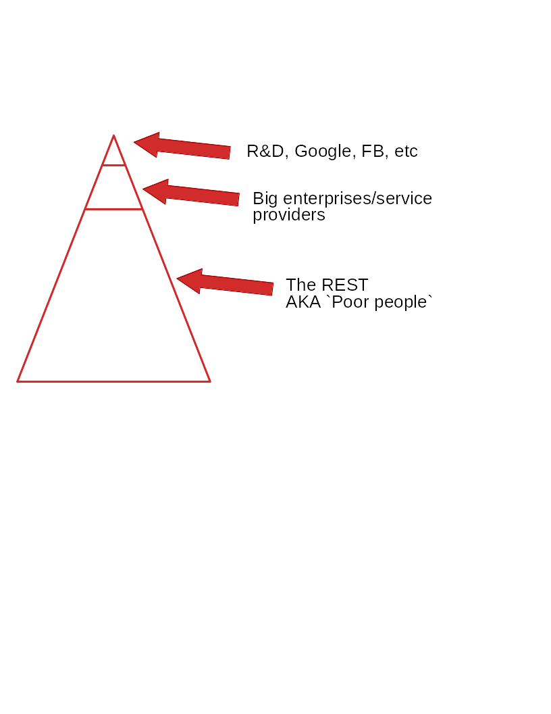
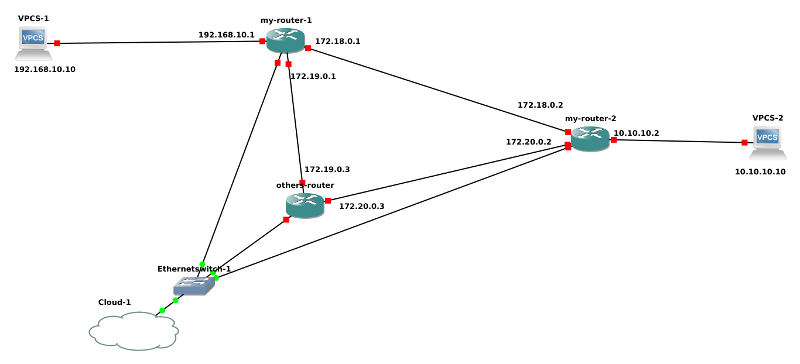
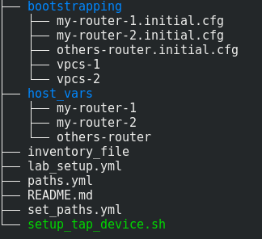

## Poor man's SDN using Ansible
#### ibrahim menem, SRE @CARTO
##### @ibrahimmenem

---
## the SDN pyramid 


---


---
## Ansible to the rescue

- Many people don't know about Ansible's network modules
- There are a *lot* of modules available from vendors and the community
[link](http://docs.ansible.com/ansible/latest/list_of_network_modules.html) 
- Many improvements after Ansible 2.3 
    - persistent connections
    - pass credentials via the command line
---
### What do I need to use Ansible with Network devices
- Remember to use  `'connection: local'`
- Ssh access to the network deviceS
- **(the hardest one)** Your boss and security people are happy with your work. 

--- 
### GNS3 lab


---


--- 
#### I don't need SDN nor Ansible to do that 


--- 
[TRUE]
- We can do that using traditional routing, vendors' active probes, etc

[BUT]
- This way we are separating our logic from forwarding elements
- We can control different nodes from central control point
- We can easily integrate with external services:
    - pull information from a database.
    - push information to monitoring system
   
---
## The repo
https://github.com/ibrahimmenem/ansible_poor_mans_sdn


---
```yaml
- hosts: my_routers
  gather_facts: no
  connection: local

  tasks:
    # load all paths parameters into `paths` variable  
    - name: load defined paths
      include_vars:
        file: paths.yml
        name: paths

    # test prefered path using ping 
    - name: test ping
      ios_ping:
        dest: "{{ paths[paths['prefered']][inventory_hostname]['next_hop'] }}" 
      register: result_of_ping
      ignore_errors: True

    - set_fact: {'active_path': "{{ paths['backup'] }}"}
      when: result_of_ping|failed

    - set_fact: {'active_path': "{{ paths['prefered'] }}"}
      when: result_of_ping|succeeded
    # start a block to remove old routes and install new ones   
    - name: remove old path and setup the new one
      block:
        - ios_config:
            lines:
              - "no ip route {{paths[active_path][inventory_hostname]['prefix']}} {{paths[active_path][inventory_hostname]['mask']}}"
            authorize: yes

        - ios_static_route:
            prefix : "{{ paths[active_path][inventory_hostname]['prefix'] }}"
            mask: "{{ paths[active_path][inventory_hostname]['mask'] }}"
            next_hop: "{{ paths[active_path][inventory_hostname]['next_hop'] }}"
            authorize: yes
      rescue:
        - debug:
            msg: "An Error occured => rollback"
```
@[3]
@[6-10]
@[12-23]
@[26-37]
---
### Final tip
- If you need to screen scrape + parse cli output. 
- Because the network devices don't provide any API or is badly implemented (netconf returns the output from cli).
- Do yourself a favor and don't start parsing everything from scratch:
    - [NAPALM](https://napalm.readthedocs.io/en/latest/): already a lot of parsing and abstraction is done + great community.
    - [Textfsm](https://github.com/google/textfsm): allows you to separate pasing logic from your code.

---
# Thank you
